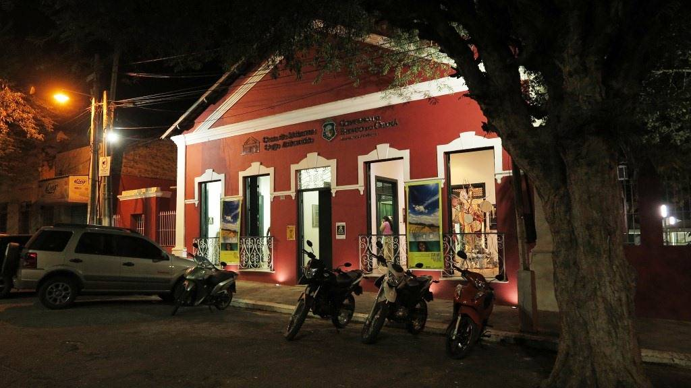
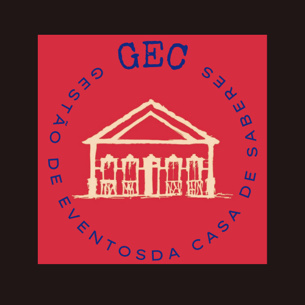

#  Gestão de Eventos Culturais da Casa de Saberes Cego Aderaldo (GEC) 

A Casa de Saberes Cego Aderaldo é um espaço institucional da Secretaria da Cultura do Estado do Ceara (Secult), localizado em Quixadá-CE, é um ambiente voltado à arte, à educação e ao patrimônio cultural. Construída coletivamente, dialoga com os diversos agentes, segmentos, setores e instituições da região do Sertão Central, buscando fomentar a pesquisa, a formação, a difusão e a fruição das expressões culturais.

## Sobre O SGEC

O SGEC é um projeto de extensão da disciplina de PIES I (Projeto Integrado 1 de Engenharia de Software) na UFC-Quixadá. Portanto é multidisciplinar, abrangendo áreas da Engenharia de Software que foram anteriormente estudadas pelos universitários desenvolvedores do sistema, como IHC, FBD, FUP, POO, ED, entre outras. Esse sistema de gestão tem como seu objetivo principal fornecer uma interface para que os membros administrativos e da comunicação da Casa de Saberes Cego Aderaldo possam armazenar as informações dos diferentes tipos de eventos realizados por eles. E assim auxiliar a preservar o patrimônio cultural, além de facilitar as operações de divulgação e prestação de contas para o Instituto Dragão do Mar de Fotaleza-CE.

## Documentação do Projeto
- [Todos os DOCS](https://github.com/gustavohenriquefs/SGEC/wiki)
  
Aqui você irá encontrar os principais documentos do projeto. São eles que irão orientar todos os stakeholders a respeito da visão, escopo ,requisitos funcionais e não funcionais, regras de negócio, protótipos de baixa e alta fidelidade e mais qualquer outro documento feito no projeto.
## Sobre o Product Backlog
A documentação do Backlog está disponível na aba projectsjunto a todos os outros documentos do projeto. Todavia, vale destacar que este trabalho é baseado em uma divisão de 4 entregas, nas quais 3 são parciais e 1 é a do produto final.

### Desenvolvedores
- [Jhordanna Gonçalves](https://github.com/ceulazur) - jhordanna@alu.ufc.br
- [Francisco Paulino](https://github.com/Francisco-Paulino-Arruda-Filho) - paulinofilho@alu.ufc.br
- [Gustavo Henrique](https://github.com/gustavohenriquefs) - gustavohenriquefs.dev@gmail.com
- [João Pedro](https://github.com/Joao-Pedro-P-Holanda) - joaopedroph@alu.ufc.br
- [Robson Diógenes](https://github.com/robsonad07) - robsonad07@alu.ufc.br
  
  
## Créditos
Imagem de localização: <a href="https://www.freepik.com/icon/security-pin_6125244#fromView=keyword&term=Local&page=1&position=14">Icon by Muhammad_Usman</a>

Imagem da leftArrow: <a href="https://images.app.goo.gl/NkXbvK76VHFTzero6">LeftArrow</a>
